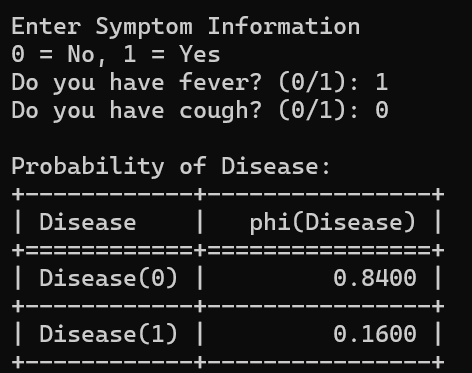

# Bayesian Network for Disease Diagnosis

## Overview

This project demonstrates a simple Bayesian Network using the Python library **pgmpy**. The network predicts the probability of a disease based on two symptoms:

- Fever
- Cough

The program takes user input for symptoms and uses probabilistic inference to estimate the likelihood of having the disease.


## Bayesian Network Structure

```text
Disease
   |
   ├── Fever
   |
   └── Cough
```

- **Disease** is the parent node.
- **Fever** and **Cough** depend on the disease.


## Requirements

Install the required package:

```bash
pip install pgmpy
```

## How to Run

Execute the Python file:

```bash
python disease_bayes.py
```


## Input

The program asks for symptom information:

```text
Do you have fever? (0/1):
Do you have cough? (0/1):
```

Where:

- `0` = No
- `1` = Yes


## Sample Input and Output



## Features

- Models uncertain medical diagnosis using Bayesian Networks.
- Uses Conditional Probability Tables (CPTs).
- Performs probabilistic inference with Variable Elimination.
- Interactive user input for symptoms.


## Applications

- Medical diagnosis systems
- Decision support systems
- Expert systems
- Artificial Intelligence under uncertainty


## Concepts Used

- Bayesian Networks
- Probabilistic Reasoning
- Conditional Probability
- Variable Elimination
- Uncertainty Modeling
