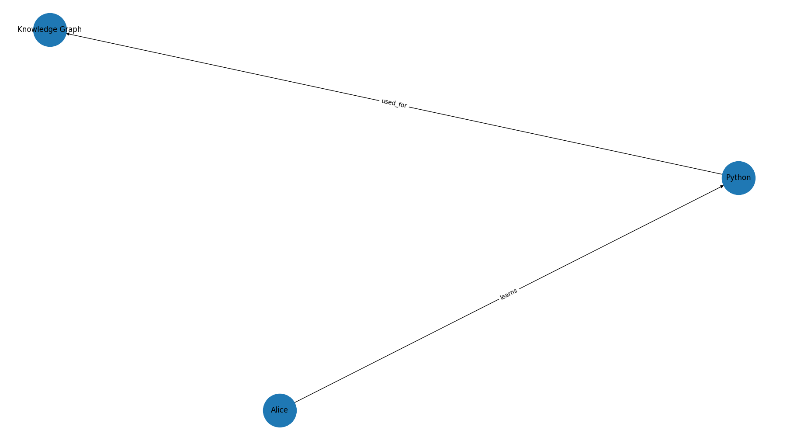

# Knowledge Graphs

A **Knowledge Graph (KG)** is a structured representation of knowledge where entities (people, places, objects, concepts) are represented as nodes and the relationships between them are represented as edges. Knowledge Graphs help organize information in a way that machines can understand and reason about.

## Popular Tools for Building Knowledge Graphs

- **Neo4j** – Graph database for storing and querying Knowledge Graphs.
- **Apache Jena** – Framework for RDF data and SPARQL queries.
- **Protégé** – Ontology editor for designing knowledge models.
- **RDFLib** – Python library for creating and manipulating RDF graphs.
- **NetworkX** – Python library for creating and visualizing graph structures.
- **GraphDB** – Semantic graph database supporting RDF and OWL.

# Knowledge Graph Using NetworkX

# Academic Knowledge Graph

## Overview

This project demonstrates the creation and visualization of a simple Academic Knowledge Graph using Python. The graph represents relationships between students, skills, and domains using the NetworkX library.

The project also generates static and interactive visualizations and calculates node importance using betweenness centrality.

## Features

- Creates a directed knowledge graph
- Stores entities and relationships using Pandas DataFrames
- Calculates betweenness centrality
- Exports the graph in GraphML format
- Generates a PNG visualization
- Generates an interactive HTML visualization using PyVis

## Technologies Used

- Python
- NetworkX
- Pandas
- Matplotlib
- PyVis

## Entities

| Entity | Category |
|---------|----------|
| Emma | Student |
| Liam | Student |
| Python | Skill |
| Machine Learning | Skill |
| Data Science | Domain |

## Relationships

| Source | Relationship | Target |
|---------|-------------|---------|
| Emma | learns | Python |
| Liam | studies | Machine Learning |
| Python | used_in | Data Science |
| Machine Learning | applied_to | Data Science |
| Emma | collaborates_with | Liam |

## Output Files

After execution, the following files are generated inside the `results` folder:




## How to Run

### 1. Install Required Libraries

```bash
pip install networkx matplotlib pandas pyvis
```

### 2. Run the Program

```bash
python academic_graph.py
```

### 3. View the Results

Open the generated files from the `results` directory.

## Applications

- Knowledge Representation
- Educational Data Analysis
- Relationship Mapping
- Graph-Based Learning Systems
- Artificial Intelligence
